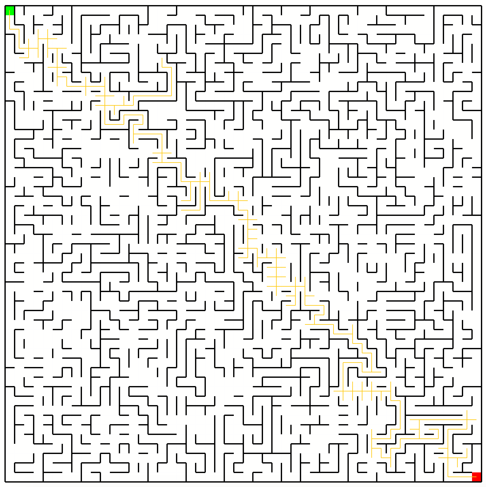

# Hausarbeit Wegsuche



## Compiling GUI
To draw the maze, c++ makes use of libxd:
https://bernhardfritz.github.io/libxd/#/

Change directory to the libxd root directory

### Windows

#### Prerequires 
- mingw-w64 version >= 4.8.1

#### Compiling

```bash
g++ -std=c++11 ../main.cpp -o sketch -D"makeGUI" -Iinclude -Llib -lxd -lglad -lglfw3 -lkernel32 -luser32 -lgdi32 -lwinspool -lshell32 -lole32 -loleaut32 -luuid -lcomdlg32 -ladvapi32
```
Start compiled file
```bash
.\sketch.exe
```

### macOS

#### Prerequires 
- gcc version >= 4.8.1

#### Compiling
```bash
g++ -std=c++11 ../main.cpp -o sketch -D"makeGUI" -Iinclude -Llib -lxd -lglad -lglfw3 -framework Cocoa -framework IOKit -framework CoreFoundation -framework CoreVideo
```
Start compiled file
```bash
./sketch
```

## Unit-Tests
To start Unit-Tests, please install the c++ boost framework.


